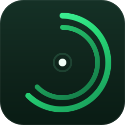
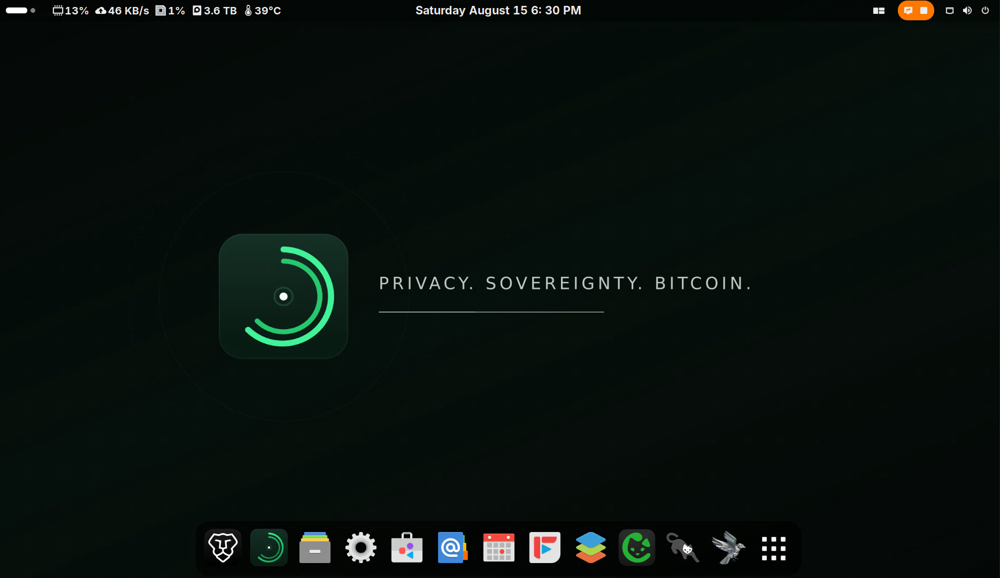
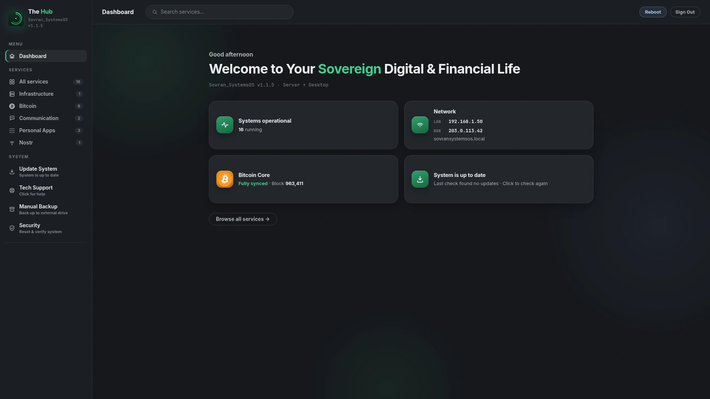

<div align="center">



# Sovran_SystemsOS

### Bitcoin sovereignty. Sovereign computing. One system.

Sovran_SystemsOS is a free and open-source operating system built for two
inseparable freedoms: **Bitcoin self-custody** and **sovereign computing**.
Hold your own keys, trade peer-to-peer, and verify your own money with your
own node. Then claim that same uncompromising ownership over the rest of your
digital life — your files, communications, passwords, and websites — all on
hardware you control, running auditable open-source software you can trust.

Every installation is a private [NixOS](https://nixos.org) desktop with
[Sparrow Wallet](https://sparrowwallet.com), [Bisq](https://bisq.network), and
[Bisq 2](https://github.com/bisq-network/bisq2) ready to use. Move beyond
custodial exchanges from the first boot, and grow into your own Bitcoin node,
Lightning infrastructure, private cloud, and communications platform when you
are ready.

[Visit the Website](https://sovransystems.com) ·
[Download the ISO](https://downloads.sovransystems.com/Sovran_SystemsOS-1.1.3.iso) ·
[Try it safely in a VM](#try-it-first-in-a-virtual-machine) ·
[Verify the Download](https://downloads.sovransystems.com/Sovran_SystemsOS-1.1.3.iso.sha256) ·
[Build from Source](#build-from-source)



*Bitcoin sovereignty from the first boot.*

</div>

> **📌 Active development on GitHub `main` / Gitea `staging-dev` — releases on
> [Gitea `stable`](https://git.sovransystems.com/Sovran_Systems/Sovran_SystemsOS/src/branch/stable).**
> See [Development workflow](#development-workflow) for details.

---

## Contents

- [Why Sovran_SystemsOS?](#why-sovran_systemsos)
- [Try it first in a virtual machine](#try-it-first-in-a-virtual-machine)
- [What is included](#what-is-included)
- [Three modes](#three-modes)
- [Use it your way](#use-it-your-way)
- [The Sovran Hub](#the-sovran-hub)
- [Install Sovran_SystemsOS](#install-sovran_systemsos)
- [For developers](#for-developers)
  - [Development workflow](#development-workflow)
  - [Build from source](#build-from-source)
  - [Publishing a release](#publishing-a-release)
- [About Bitcoin wallet entropy](#about-bitcoin-wallet-entropy)
- [Security approach](#security-approach)
- [Acknowledgements](#acknowledgements)
- [License](#license) · [Contributing](#contributing)

---

## Why Sovran_SystemsOS?

Bitcoin lets you hold and transfer value without asking a bank, exchange, or
custodian for permission. But that freedom depends on the software and
infrastructure you choose. Your wider digital life works the same way: files,
messages, and passwords kept on someone else's servers are never fully yours.

Sovran_SystemsOS solves both with one operating system:

- **Hold your own keys** with Sparrow Wallet. Create and manage wallets,
  connect hardware signing devices, use multisignature setups, build and
  inspect transactions, and control UTXOs and coin selection.
- **Buy and sell Bitcoin peer-to-peer** with Bisq and Bisq 2. No central
  company holds user funds, and no exchange account stands between buyers and
  sellers.
- **Verify your own Bitcoin** with a full node: [Bitcoin Core](https://bitcoin.org) and
  [Electrs](https://github.com/romanz/electrs), so your wallets connect to
  *your* node instead of a stranger's.
- **Use Lightning** with [LND](https://github.com/lightningnetwork/lnd) and
  [Ride The Lightning](https://github.com/Ride-The-Lightning/RTL).
- **Accept Bitcoin directly** with [BTCPay Server](https://btcpayserver.org),
  with no payment processor in the middle.
- **Own the rest of your digital life** with
  [Nextcloud](https://nextcloud.com) files and calendars,
  [Matrix](https://matrix.org) communications, a
  [Vaultwarden](https://github.com/dani-garcia/vaultwarden) password vault,
  and your own [WordPress](https://wordpress.org) website.
- **Protect your network privacy** with [Tor](https://www.torproject.org)
  integration across the Bitcoin stack.
- **Control everything from the Sovran Hub**, on the desktop or from any
  browser on your local network.

No custodian needs to hold your Bitcoin. No outside node needs to tell your
wallet what happened on the network. No third-party cloud needs to control
your data or services.

Other projects solve one piece of this puzzle: a Linux distribution that can
run a wallet, a node project that runs Bitcoin services, a self-hosting stack
that replaces a cloud app. Sovran_SystemsOS brings those worlds together and
makes them approachable: Bitcoin tools from the first boot, a complete path
from desktop to node to self-hosting, one control center, hardware you own,
and a reproducible, auditable NixOS foundation.

> Sovran_SystemsOS provides tools for self-custody and peer-to-peer Bitcoin
> use. Users remain responsible for protecting their keys, understanding their
> trades, following applicable laws, and maintaining secure backups.

---

## Try it first in a virtual machine

**Curious, but not ready to replace your current operating system?** Start with
Sovran_SystemsOS in a virtual machine (VM). A VM runs Sovran_SystemsOS in a
window on your existing Windows, macOS, or Linux computer, using a virtual disk
file instead of your computer's internal drive. You can explore the desktop,
Sovran Hub, Sparrow, Bisq, and the installation experience before changing how
you use any physical machine.

This is a low-commitment way to decide whether Sovran_SystemsOS is right for
you:

- **Keep your current OS.** Closing or deleting the VM leaves the host operating
  system in place.
- **Learn at your own pace.** Familiarize yourself with the desktop and tools
  without needing to make it your daily computer on day one.
- **Choose your next step with confidence.** When you are ready, install it on
  a dedicated computer, or keep using the VM as a learning environment.

You can use the same ISO with [VirtualBox](https://www.virtualbox.org), VMware,
QEMU/KVM, Proxmox, and similar x86_64 VM software. For a first look, select
**Desktop Only**, allocate at least **8 GB RAM**, and create a **256 GB or
larger dynamically allocated virtual disk**. The full VM setup and installer
requirements are in [Installing in a virtual machine](#installing-in-a-virtual-machine-optional).

> **A VM is for evaluation and learning, not a substitute for a dedicated,
> hardened setup.** Do not use a trial VM to hold meaningful Bitcoin, recovery
> phrases, passwords, or other sensitive data. Avoid attaching physical drives
> to the VM, and be deliberate about shared folders, clipboard sharing, and
> network settings. The installer only changes the disk you select, but you
> should always review VM disk selections before confirming an install.

---

## What is included

Depending on the selected mode and enabled features, Sovran_SystemsOS brings
together a growing collection of private, open-source tools. The Sovran Hub
presents and manages the features available on your system.

### Your money — Bitcoin sovereignty

- Bitcoin Core, Electrs, and Tor integration
- LND and Ride The Lightning, with [Alby Hub](https://albyhub.com) for Nostr
  Wallet Connect (NWC) connections
- BTCPay Server
- Sparrow Wallet, Bisq, and Bisq 2, with automatic wallet-to-node connections
- Optional: a self-hosted [Mempool](https://github.com/mempool/mempool)
  explorer

Run your own Bitcoin infrastructure. Verify your own money. Trust no one.

### Your voice — private communications

- The [Synapse](https://github.com/element-hq/synapse) homeserver (Matrix) and
  the [Element](https://element.io) client
- Optional Matrix-native Element audio and video calling, powered by
  [LiveKit](https://livekit.io)
- Optional [Haven](https://github.com/bitvora/haven)
  [Nostr](https://github.com/nostr-protocol/nostr) relay

Communicate without making Big Tech the owner of your identity or
conversations.

### Your cloud — self-hosting and storage

- Nextcloud files, calendars, and contacts
- Vaultwarden password vault
- WordPress websites
- [Caddy](https://caddyserver.com) with private service domains
- Optional remote desktop

Keep your files, passwords, calendar, contacts, website, and services on
hardware you control.

### Your desktop

- [GNOME](https://www.gnome.org) desktop
- [Brave Origin](https://brave.com/origin/) and
  [Firefox](https://www.mozilla.org/firefox) browsers
- File management, email, calendar, and office applications
- System monitoring and administration tools

---

## Three modes

Every mode shares the same foundation: the private NixOS and GNOME desktop,
the Sovran Hub, and Sparrow, Bisq, and Bisq 2. What changes is how much
Bitcoin and self-hosting infrastructure runs on the machine.

| Mode | Best for | What you get |
|---|---|---|
| **Desktop** | Everyday users and computers with modest hardware | Sparrow, Bisq, and Bisq 2 for self-custody and peer-to-peer Bitcoin use |
| **Node** | People ready to verify and operate their own Bitcoin infrastructure | Everything in Desktop, plus the full Bitcoin stack: Bitcoin Core, Electrs, LND, Ride The Lightning, BTCPay Server, and wallet-to-node connections |
| **Server + Desktop** | Bitcoiners who want the same sovereignty over their communications, cloud, passwords, and web services | The complete Node stack, plus the private self-hosted services |

**Desktop: start with your keys.** Desktop is not a reduced or Bitcoin-free
edition. It is a complete, private everyday computer with a clean GNOME
desktop, Tor, and the Sovran Hub, giving you a lower-hardware path to
self-custody and non-KYC Bitcoin tools from the first boot. You do not need a
fully synchronized node to begin; move to Node mode when your hardware,
storage, and needs are ready.

**Node: verify your own money.** Instead of asking someone else's server
about your wallet and transactions, you operate the infrastructure that
performs the verification. Your node verifies. Your wallet connects to it.
Your keys remain yours.

**Server + Desktop: sovereignty beyond money.** Bitcoin sovereignty is the
foundation. Server + Desktop applies the same principle to your data,
communications, identity, and services.

### Recommended hardware

| | **Desktop** | **Node** | **Server + Desktop** |
|---|---|---|---|
| Processor | 64-bit Intel or AMD, ~2015 or newer | Intel or AMD x86, ~3 years old or newer | Same as Node |
| RAM | 8 GB | 16 GB | 32 GB |
| Storage | 256 GB SSD | 500 GB NVMe (OS) + 2 TB NVMe (timechain) | Same as Node |
| Network | Any broadband | Unmetered, ~200 Mbps down / 50 Mbps up | Same as Node |
| Also needed | — | — | A domain for publicly accessible services |

> **Before choosing Server + Desktop:** this mode makes services reachable from
> the public internet, which means opening specific ports on your home network.
> Before you start, confirm three things: you can log in to your router's admin
> panel, the panel includes a port-forwarding section, and your internet
> provider allows port forwarding. Most home routers and providers already
> support this. If you are unsure, a quick search for your router model and
> "port forwarding" will usually turn up a step-by-step guide.

---

## Use it your way

You do not have to replace the operating system on your current computer to
benefit from Sovran_SystemsOS.

### As your everyday computer

Install Sovran_SystemsOS on a desktop, laptop, or mini PC and use its clean
GNOME desktop as your daily operating system, with the Bitcoin software and
the tools of your selected mode already in place.

### As a private Bitcoin and home server

Prefer to keep using Windows, macOS, Linux, Android, or iOS? Install
Sovran_SystemsOS on a separate computer and let it run quietly on your local
network, with or without a monitor. From any other device on the same network,
open a browser, visit `http://sovransystemsos.local`, and manage everything
from [The Sovran Hub](#the-sovran-hub).

Your existing devices stay familiar. Sovran_SystemsOS provides the independent
infrastructure behind them.

---

## The Sovran Hub

### Your private infrastructure, controlled from any screen.

The Sovran Hub is the command center built into Sovran_SystemsOS. It is both a
local desktop application and a private web interface served directly by your
Sovran_SystemsOS machine. Nothing needs to be installed on the device opening
the Hub: you only need a modern browser and access to the same local network.

From one place, the Hub helps you:

- Open, monitor, start, and stop your services
- See what is running and configure system features
- Manage service domains and credentials
- Reach your Bitcoin tools, private cloud, and communications
- Perform supported system operations without everyday terminal commands



*The Sovran Hub: manage your private infrastructure from one place.*

### Example home setup

```text
                          Your local network
                                 │
          ┌──────────────────────┼──────────────────────┐
          │                      │                      │
    Windows laptop         Phone or tablet          Mac or Linux
          │                      │                      │
          └──────── Browser: sovransystemsos.local ────┘
                                 │
                                 ▼
                    ┌──────────────────────────┐
                    │   Sovran_SystemsOS       │
                    │                          │
                    │   • Sovran Hub           │
                    │   • Bitcoin node         │
                    │   • Sparrow Wallet       │
                    │   • Bisq and Bisq 2      │
                    │   • Lightning            │
                    │   • Private cloud        │
                    │   • Communications       │
                    │   • Password vault       │
                    │   • Hosted services      │
                    └──────────────────────────┘
```

Keep using the devices you already own. Sovran_SystemsOS becomes the private
Bitcoin and digital infrastructure behind them.

> **Local access:** the Hub is available at
> `http://sovransystemsos.local` to devices connected to the same local
> network. It is protected by authentication and is not automatically exposed
> to the public internet.

---

## Install Sovran_SystemsOS

Sovran_SystemsOS is free and open source. You can download the installer,
verify it, write it to a USB drive, and install it yourself, staying in
control from the very first step.

An ISO is a complete installation image containing the operating system and
installer. It is not copied to a USB drive like a document; it must be written
with an imaging application such as [Balena Etcher](https://etcher.balena.io).

**Before you begin, you will need:**

- A compatible 64-bit computer, and a backup of anything important on it
- A USB drive that can be erased
- Another computer for downloading and preparing the installer
- An internet connection

> **Important:** Installing an operating system can erase the selected
> destination drive. Back up important files and review every disk selection
> carefully before continuing.

### 1. Download the ISO and checksum

- [Download Sovran_SystemsOS-1.1.3.iso](https://downloads.sovransystems.com/Sovran_SystemsOS-1.1.3.iso)
- [Download Sovran_SystemsOS-1.1.3.iso.sha256](https://downloads.sovransystems.com/Sovran_SystemsOS-1.1.3.iso.sha256)

The download may take some time. Do not rename or modify the ISO before
verifying it, and keep both files in the same folder.

### 2. Verify the checksum

A checksum is a digital fingerprint of a file. Verifying it confirms that the
ISO downloaded completely, was not accidentally corrupted, and matches the
published image. The checksum produced from your ISO must match the published
checksum exactly.

<details>
<summary><strong>Linux</strong></summary>

Open a terminal in the download folder and run:

```bash
sha256sum --check Sovran_SystemsOS-1.1.3.iso.sha256
```

A successful comparison reports:

```text
Sovran_SystemsOS-1.1.3.iso: OK
```

You can also run `sha256sum Sovran_SystemsOS-1.1.3.iso` and compare the output
against the checksum file manually.

</details>

<details>
<summary><strong>macOS</strong></summary>

Open Terminal in the download folder and run:

```bash
shasum -a 256 Sovran_SystemsOS-1.1.3.iso
```

Compare the value shown in Terminal with the value inside
`Sovran_SystemsOS-1.1.3.iso.sha256`.

</details>

<details>
<summary><strong>Windows</strong></summary>

Open PowerShell in the download folder and run:

```powershell
Get-FileHash .\Sovran_SystemsOS-1.1.3.iso -Algorithm SHA256
```

Compare the value under `Hash` with the published checksum.

</details>

**If the values do not match, do not install.** Delete the downloaded ISO,
download it again, and repeat the verification. Continue only after the values
match exactly.

### 3. Write the ISO to a USB drive

1. Download and install [Balena Etcher](https://etcher.balena.io), then
   connect the USB drive.
2. Choose **Flash from file** and select `Sovran_SystemsOS-1.1.3.iso`.
3. Choose **Select target**, select the USB drive, and review your selection
   carefully.
4. Choose **Flash** and wait for the writing and verification process to
   finish.

> **Warning:** Flashing erases the selected drive. Verify that you selected
> the USB drive and not another storage device.

After flashing, your computer may report that it cannot read the USB drive or
may show several unfamiliar partitions. This is normal for a bootable Linux
installer. Do not format the drive.

### 4. Boot from the USB drive

1. Leave the USB drive connected and restart the destination computer.
2. Open the computer's boot-device menu. Common keys include `F12`, `F11`,
   `F10`, `F9`, `Esc`, and `Delete`; the correct key is often shown briefly
   when the computer powers on.
3. Select the USB drive and start the Sovran_SystemsOS installer.

If the normal operating system starts instead, restart and try the boot-menu
key again.

### Installing in a virtual machine (optional)

Sovran_SystemsOS can be tested in VirtualBox, VMware, QEMU/KVM, Proxmox, and
similar x86_64 virtual machines. Use production-like resources where possible:

- Allocate **8 GB RAM or more** for Desktop Only. Node and Server + Desktop
  should follow the normal 16 GB / 32 GB recommendations.
- Create a **256 GB or larger virtual OS disk**. Thin-provisioned / dynamically
  allocated disks are fine; they do not consume the full size immediately.
- Use NAT or bridged networking with internet access before opening the
  installer.
- UEFI/EFI firmware is preferred. In UEFI VMs, the installer avoids depending
  on VM NVRAM boot-entry writes. If a VM boots the ISO in legacy BIOS mode,
  the installer automatically switches the installed system to GRUB.
- For Node or Server + Desktop, attach a **second 2 TB virtual data disk**.
  If you only attach one disk, choose **Desktop Only**.
- Present the install target as a normal virtual disk such as VirtIO, SATA,
  SCSI, or NVMe. USB-attached target disks are intentionally hidden by the
  installer to avoid erasing the installer USB by mistake.

### 5. Install

Follow the on-screen installer. Before confirming:

- Verify that you selected the correct destination drive.
- Understand that existing partitions and data may be erased.
- Disconnect unrelated external drives if you are unsure which drive is which.
- Confirm that the computer is connected to reliable power.

When installation is complete, restart the computer, remove the USB drive when
instructed, allow Sovran_SystemsOS to start from the installed drive, and
complete the initial setup.

### 6. Open the Sovran Hub

Open the Hub directly from the Sovran_SystemsOS desktop, or from any other
device on the same local network at:

```text
http://sovransystemsos.local
```

Sign in with your Sovran_SystemsOS credentials.

<details>
<summary><strong>If sovransystemsos.local does not open</strong></summary>

1. Make sure the Sovran_SystemsOS machine is powered on, and allow it a few
   minutes to finish starting.
2. Make sure both devices are connected to the same local network, and that
   you entered the full address `http://sovransystemsos.local`.
3. Avoid guest Wi-Fi networks, which may prevent devices from seeing one
   another.
4. Temporarily disconnect any VPN that may interfere with local-network
   access.
5. Try another browser or device on the same network.

Some networks or devices may not support `.local` address discovery correctly.
Network isolation, custom DNS settings, VPNs, and some routers can interfere
with local-device discovery.

</details>

### Prefer guided help?

Not technical? You do not have to figure everything out alone. Visit the
[Sovran Systems website](https://sovransystems.com) to learn about guided
setup, supported hardware, and Royal Membership.

---

## For developers

Sovran_SystemsOS combines [NixOS](https://nixos.org), an in-repository
Bitcoin and Lightning stack, desktop packages from
[btc-clients-nix](https://github.com/emmanuelrosa/btc-clients-nix), and the
Sovran Hub. The Bitcoin modules under `modules/bitcoin/` were adapted from
[nix-bitcoin](https://github.com/fort-nix/nix-bitcoin) and are now maintained
here. Builds no longer import or fetch nix-bitcoin. Legacy `nix-bitcoin.*`
option names and `/etc/nix-bitcoin-secrets` remain for compatibility.

### Development workflow

| Branch        | Host                                              | Purpose                     |
|---------------|---------------------------------------------------|-----------------------------|
| `main`        | [GitHub](https://github.com/naturallaw777/Sovran_SystemsOS) | Active development & PRs    |
| `staging-dev` | [Gitea](https://git.sovransystems.com/Sovran_Systems/Sovran_SystemsOS) | Synced with `main`          |
| `stable`      | [Gitea](https://git.sovransystems.com/Sovran_Systems/Sovran_SystemsOS/src/branch/stable) | Tested, release-ready builds |

**Flow:** develop → sync `main` ↔ `staging-dev` → promote to `stable`

> ⚠️ `main` and `staging-dev` may contain unreleased or less-tested code. For
> stable, audited code, use Gitea
> [`stable`](https://git.sovransystems.com/Sovran_Systems/Sovran_SystemsOS/src/branch/stable).

### Technology

- [NixOS](https://nixos.org) and [Nix flakes](https://nixos.wiki/wiki/Flakes)
  for declarative, pinned system configuration
- `modules/bitcoin/` for the in-repository Bitcoin and Lightning stack
- `packages/` for Sovran-maintained package definitions and patches
- [btc-clients-nix](https://github.com/emmanuelrosa/btc-clients-nix) for the
  Sparrow, Bisq, and Bisq 2 packages
- [Python](https://www.python.org) and [FastAPI](https://fastapi.tiangolo.com)
  for the Sovran Hub backend
- JavaScript, HTML, and CSS for the Hub interface
- [GNOME](https://www.gnome.org) desktop environment
- [Caddy](https://caddyserver.com) for local and public service routing
- [Tor](https://www.torproject.org) for Bitcoin network privacy
- [AGPL-3.0](LICENSE) licensing

### Build from source

You need a system with Nix installed and flakes enabled.

Clone the **stable** branch from Gitea (recommended for builds):

```bash
git clone -b stable https://git.sovransystems.com/Sovran_Systems/Sovran_SystemsOS.git
cd Sovran_SystemsOS
```

Or clone the **active development** line from GitHub:

```bash
git clone https://github.com/naturallaw777/Sovran_SystemsOS.git
cd Sovran_SystemsOS
```

Then build the installer ISO:

```bash
nix build \
  .#nixosConfigurations.sovran_systemsos-iso.config.system.build.isoImage
```

The resulting build output will be available through the `result` symlink.

### Publishing a release

Releases are managed with `scripts/release-stable.sh` and `scripts/upload-cdn.sh`:

1. Run the stable release script to bump version, tag, update changelog, and push/create releases:
   ```bash
   ./scripts/release-stable.sh [version]
   ```
2. Build the installer ISO:
   ```bash
   nix build .#nixosConfigurations.sovran_systemsos-iso.config.system.build.isoImage
   ```
3. Copy, checksum, verify, and optionally upload to CDN:
   ```bash
   ./scripts/upload-cdn.sh --upload
   ```

### Common development commands

Run these commands from the flake root.

```bash
# Build the installer ISO
nix build \
  .#nixosConfigurations.sovran_systemsos-iso.config.system.build.isoImage

# Build the system configuration
nixos-rebuild build --flake .#nixos

# Test without making the change permanent
sudo nixos-rebuild test --flake .#nixos

# Activate the new configuration
sudo nixos-rebuild switch --flake .#nixos

# Stage the configuration for the next boot
sudo nixos-rebuild boot --flake .#nixos

# Update pinned flake inputs (review and test before committing flake.lock)
nix flake update

# Roll back the last activated generation
sudo nixos-rebuild switch --rollback
```

### Repository map

| Path | Purpose |
|---|---|
| `flake.nix` | Declares flake inputs, the running system, and installer outputs |
| `flake.lock` | Pins dependencies for reproducible builds |
| `configuration.nix` | Base host, boot, desktop, user, security, backup, and system configuration |
| `modules/` | Core modules, self-hosted services, and optional features |
| `modules/bitcoin/` | In-repository Bitcoin and Lightning service modules |
| `modules/core/` | Roles, Hub integration, Caddy, desktop, support, and other core behavior |
| `app/` | Sovran Hub backend, templates, static assets, scripts, and web interface |
| `scripts/` | Automated release, build, and CDN upload utility scripts |
| `iso/` | Installer configuration, installer code, and installer assets |
| `packages/` | Sovran-maintained package definitions and patches |
| `tests/` | Security and Nix integration checks |
| `assets/` | Documentation images |
| `custom.template.nix` | Template for local features and service overrides |

On installed systems, `flake.nix` also imports `role-state.nix` (the selected
mode), `custom.nix` (generated from `custom.template.nix`), and
`hardware-configuration.nix`. These are generated per machine, so they are
gitignored and not part of this repository.

### Architecture overview

Sovran_SystemsOS is assembled from a reproducible Nix flake.

```text
                       ┌─────────────────────────┐
                       │        flake.nix        │
                       │                         │
                       │ Inputs and system       │
                       │ build outputs           │
                       └────────────┬────────────┘
                                    │
                                    ▼
                       ┌─────────────────────────┐
                       │    configuration.nix    │
                       │                         │
                       │ Host, desktop, users,   │
                       │ boot, security, backup  │
                       └────────────┬────────────┘
                                    │
                                    ▼
                       ┌─────────────────────────┐
                       │   modules/modules.nix   │
                       │                         │
                       │ Core modules, services, │
                       │ and optional features   │
                       └────────────┬────────────┘
                                    │
                 ┌──────────────────┼──────────────────┐
                 │                  │                  │
                 ▼                  ▼                  ▼
          ┌────────────┐     ┌────────────┐     ┌────────────┐
          │ Sovran Hub │     │  Bitcoin   │     │  Private   │
          │ and desktop│     │ ecosystem  │     │  services  │
          └────────────┘     └────────────┘     └────────────┘
```

The Hub writes supported user choices into the local configuration. NixOS then
rebuilds the machine into the selected declarative state.

### Module overview

| Area | Modules |
|---|---|
| Core platform: roles, Hub, desktop integration, Caddy, domains, support, remote deployment | `modules/core/` |
| Shared credentials | `modules/credentials.nix` |
| Bitcoin and Lightning stack | `modules/bitcoinecosystem.nix` |
| Automatic wallet-to-node connections | `modules/wallet-autoconnect.nix` |
| Alby Hub and Nostr Wallet Connect (NWC) on LND | `modules/nwc-wallets.nix`, `packages/albyhub/` |
| Matrix Synapse | `modules/synapse.nix` |
| Optional Element audio and video calling via LiveKit | `modules/element-calling.nix` |
| Optional Haven Nostr relay | `modules/haven.nix` |
| Nextcloud, Vaultwarden, WordPress | `modules/nextcloud.nix`, `modules/vaultwarden.nix`, `modules/wordpress.nix`, `modules/php.nix` |
| Optional Mempool explorer | `modules/mempool.nix` |
| Optional remote desktop and public SSH | `modules/rdp.nix`, `modules/sshd.nix` |

Feature availability and defaults may change as Sovran_SystemsOS develops.
Review the relevant Nix module before relying on a specific default in a
production environment.

---

## About Bitcoin wallet entropy

Wallet recovery words control the funds. Never share them with a website,
support technician, cloud service, or chat application.

For meaningful balances, prefer a well-reviewed hardware signer and follow its
verified backup process. A BIP39 passphrase is optional, advanced protection;
it is not a replacement for the recovery words. If you use one, back it up
separately—losing either item can make the wallet unrecoverable.

Keep durable offline backups in separate secure locations. Test recovery before
relying on a wallet, and begin with a small amount.

---

## Security approach

Sovran_SystemsOS uses layered controls:

- Pinned flake inputs and hash-pinned source archives
- Bitcoin and Lightning modules maintained in this repository
- Firewall enabled; public SSH and remote desktop disabled by default
- Separate service users, systemd sandboxing, and loopback bindings where practical
- Tor enforcement for supported Bitcoin services
- Restricted, time-limited support access with scoped `sudo`
- Operator-controlled public service exposure

See [`SECURITY.md`](SECURITY.md) for the threat model, limitations, reporting,
and operator guidance. No operating system can protect funds after recovery
words, administrator credentials, or the root account are compromised. Apply
updates and keep tested offline backups.

---

## Acknowledgements

Sovran_SystemsOS stands on the work of exceptional free and open-source projects and contributors.

### NixOS

Deep gratitude goes to the [NixOS](https://nixos.org) team, the [Nixpkgs](https://github.com/NixOS/nixpkgs) maintainers, and the broader [Nix community](https://github.com/nix-community).

NixOS provides the reproducible, declarative foundation that makes Sovran_SystemsOS possible. Its module system, package ecosystem, [flakes](https://nixos.wiki/wiki/Flakes), and generation-based system management allow an entire Bitcoin operating system to be described, audited, rebuilt, upgraded, and rolled back from source.

Sovran_SystemsOS would not have the same reliability, transparency, or reproducibility without their years of work.

### nix-bitcoin

The in-repository Bitcoin stack began with code adapted from
[nix-bitcoin](https://github.com/fort-nix/nix-bitcoin), primarily from commit
[`360e30f`](https://github.com/fort-nix/nix-bitcoin/commit/360e30fee5ba32f9fecc89bc35628195d9d2dbbe).
It has since been narrowed to Sovran's supported services and is maintained in
this repository. nix-bitcoin is no longer a flake input or build dependency.

We remain grateful to the nix-bitcoin contributors for the declarative and
security-focused foundation. Its MIT notice is retained in
[`THIRD_PARTY_NOTICES.md`](THIRD_PARTY_NOTICES.md).

### Emmanuel Rosa and btc-clients-nix

Special thanks go to [Emmanuel Rosa](https://github.com/emmanuelrosa) for [btc-clients-nix](https://github.com/emmanuelrosa/btc-clients-nix).

The project provides Nix packages for the Bitcoin desktop software central to the Sovran_SystemsOS experience:

- [Sparrow Wallet](https://github.com/sparrowwallet/sparrow)
- [Bisq](https://github.com/bisq-network/bisq)
- [Bisq 2](https://github.com/bisq-network/bisq2)

This work helps make it possible for Sovran_SystemsOS to deliver self-custody and peer-to-peer Bitcoin tools as part of every installation.

### The upstream Bitcoin ecosystem

Sovran_SystemsOS also depends on the work of the developers and communities behind:

- [Bitcoin Core](https://github.com/bitcoin/bitcoin)
- [Sparrow Wallet](https://github.com/sparrowwallet/sparrow)
- [Bisq](https://github.com/bisq-network/bisq)
- [Bisq 2](https://github.com/bisq-network/bisq2)
- [Electrs](https://github.com/romanz/electrs)
- [LND](https://github.com/lightningnetwork/lnd)
- [Ride The Lightning](https://github.com/Ride-The-Lightning/RTL)
- [Alby Hub](https://github.com/getAlby/hub) for Nostr Wallet Connect (NWC)
  connections
- [BTCPay Server](https://github.com/btcpayserver/btcpayserver)
- [Tor](https://www.torproject.org)
- [NixOS](https://github.com/NixOS/nixpkgs)
- [GNOME](https://gitlab.gnome.org/GNOME)
- [Caddy](https://github.com/caddyserver/caddy)
- [Nextcloud](https://github.com/nextcloud/server)
- [Matrix Synapse](https://github.com/element-hq/synapse)
- [Element](https://github.com/element-hq/element-web)
- [LiveKit](https://github.com/livekit/livekit) for Element audio and video
  calling
- [Vaultwarden](https://github.com/dani-garcia/vaultwarden)
- [WordPress](https://github.com/WordPress/WordPress)
- Every other upstream project included in the system

Sovran Systems did not create these foundations. Our work is to bring them together into a cohesive operating system that helps more people use Bitcoin privately, independently, and with confidence.

Thank you to every developer, maintainer, reviewer, tester, documentarian, and user who keeps this ecosystem alive.

---

## License

Sovran_SystemsOS is free and open-source software licensed under the
[GNU Affero General Public License v3.0](LICENSE).

The AGPL-3.0 protects your freedom to:

- Use Sovran_SystemsOS
- Study how the system works
- Modify the source code
- Share original or modified versions
- Build and operate the system on your own hardware

If you distribute a modified version, you must make its corresponding source
code available under the same license.

Because Sovran_SystemsOS includes the browser-based Sovran Hub, operators who
modify the covered software and make that modified version available for users
to interact with over a network must offer those users access to its
corresponding source code, as required by the AGPL-3.0.

Sovran_SystemsOS is provided **without warranty**, as described in the full
license.

> Individual upstream applications, packages, artwork, fonts, and other
> components included with or built by Sovran_SystemsOS may have their own
> licenses and copyright holders. The AGPL-3.0 license for this repository does
> not replace those licenses.

Read [`LICENSE`](LICENSE) and
[`THIRD_PARTY_NOTICES.md`](THIRD_PARTY_NOTICES.md).

---

## Contributing

We welcome contributions! The
[GitHub repository](https://github.com/naturallaw777/Sovran_SystemsOS) is the
primary location for collaboration. Please read our
[Contributing Guidelines](CONTRIBUTING.md) before submitting a pull request.

<div align="center">

---

## Privacy. Sovereignty. Bitcoin.

[Visit Sovran Systems](https://sovransystems.com) ·
[Download Sovran_SystemsOS](https://downloads.sovransystems.com/Sovran_SystemsOS-1.1.3.iso) ·
[View the License](LICENSE)

</div>
