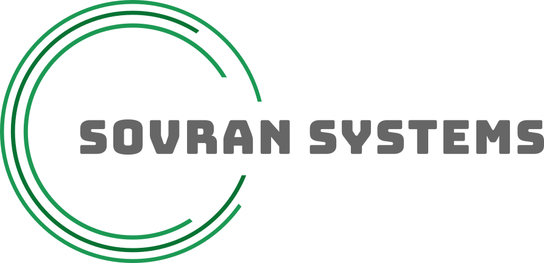

<br />
<br />

<p align="center">
  
</p>

<br />
<br />
<br />

# Sovran_SystemsOS

**A declarative, self-hosted operating system built on NixOS.**

---

## Overview

Sovran_SystemsOS is a fully integrated NixOS configuration that transforms a single machine into a personal cloud, communications hub, Bitcoin node, web server, and **daily-use desktop** — all managed declaratively.

Every service is pre-wired: reverse proxy routing, database initialization, firewall rules, automated backups, and inter-service communication are handled out of the box. Moreover, you can activate the other custom packages; the system does the rest.

---

## Architecture

Sovran_SystemsOS is structured as a set of NixOS modules exposed via a flake. A remote machine consumes the flake and selectively enables features through a simple configuration interface.

```
Repository Main Flake (flake.nix)
  └── Sovran_SystemsOS flake (nixosModules.Sovran_SystemsOS)
        ├── configuration.nix/       # Base system
        │   ├── gnome Desktop        # Gnome Desktop Interface
        │   ├── caddy                # Reverse proxy + HTTPS
        │   ├── nextcloud            # Cloud storage
        │   ├── wordpress            # CMS / publishing
        │   ├── element              # Matrix Synapse via Element Messaging App
        ├── modules/
        │   ├── bitcoinecosystem.nix # Bitcoin Core / Knots / BTCPay Server / Bitcoin Lightning
        │   ├── bip110.nix           # Bip110 Node Consensus Policy
        │   ├── element-calling.nix  # Matrix Synapse via Element + Element Voice and Video Calling
        │   ├── haven.nix            # Nostr relay
        │   ├── mempool.nix          # Mempool explorer
        │   ├── rdp.nix              # Remote desktop (RDP)
        │   ├── vaultwarden.nix      # Password management
        ├── nix-bitcoin integration
        ├── bitcoin clients integration
        │   ├── sparrow wallet       # Trusted and Standard Open Source Bitcoin Wallet
        │   ├── bisq/bisq2           # Non KYC Bitcoin Buying and Selling   
        ├── agenix (secrets management)
        └── nixvim
```

## Features

### Feature Toggles

[Custom Add-On Guide](custom-add-ons.md)

Every major service is gated behind a feature flag. Enable only what you need:

```nix
# custom.nix
{ config, pkgs, lib, ... }:

{
  
  sovran_systemsOS = {
    features = {
        bip110          = lib.mkForce true;
        element-calling = lib.mkForce true;
        haven           = lib.mkForce true;
        mempool         = lib.mkForce true;
        rdp             = lib.mkForce true;
    };
    nostr_npub = "pasteyournpubhere";
  };

}
```

No unnecessary services run. No wasted resources.

---

### Service Stack

| Category | Service | Description |
|---|---|---|
| **Web** | Caddy | Automatic HTTPS, reverse proxy for all services |
| **Cloud** | Nextcloud | File storage, sync, and collaboration |
| **CMS** | WordPress | Self-hosted publishing and content management |
| **Passwords** | Vaultwarden | Bitwarden-compatible password vault |
| **Messaging** | Element/Matrix Synapse | Federated, decentralized messaging backend |
| **Video/Voice Calling** | Element Video and Voice Calling | Decentralized Voice Over IP for Matrix with optional TURN/STUN |
| **Bitcoin** | Bitcoin Core / Knots | **Full node with optional BIP-110 consensus policy** |
| **Bitcoin Lightning** | LND | Full LND Node Connected over Tor intergrated into BTCPay Server |
| **Payments** | BTCPay Server | Self-hosted Bitcoin payment processor |
| **Explorer** | Mempool | Bitcoin mempool visualizer and block explorer |
| **Nostr** | Haven | Nostr relay server |
| **Remote Access** | GNOME Remote Desktop | RDP access with auto-generated TLS and credentials |

---

### Security

- **SSH hardened** — password authentication disabled by default
- **Fail2ban** — active on https
- **Agenix** — encrypted secrets management integrated into the flake
- **Tor** — integration into the bitcoin ecosystem
- **Firewall** — ports managed per-module; only enabled services are exposed

### Reliability

- **Automated backups** via rsnapshot
- **Scheduled maintenance** via systemd timers
- **Database initialization** handled declaratively
- **Reproducible builds** — the main system is defined in code and can be rebuilt to match most systems

---

### Network Configuration

Sovran_SystemsOS hosts public-facing services (Wordpress, Element/Element Calling, Nextcloud, BTCPayserver, Haven Relay, and Vaultwarden) that require inbound connections from the internet. To make these services accessible outside your local network, you must configure **port forwarding** on your home router.

**Before deploying, ensure you have:**

- Access to your router's administration interface (typically at `192.168.1.1` or `192.168.0.1`)
- The ability to create port forwarding rules
- The local/private IP address of the machine running Sovran_SystemsOS
- The external public IP address of the machine running Sovran_SystemsOS

**Required port forwards (depending on enabled features):**

Forward each port to the **private IP address** of your Sovran_SystemsOS machine. Only forward ports for services you have enabled.

> **Tip:** Assign a static IP or DHCP reservation to your Sovran_SystemsOS machine so the forwarding rules remain valid after reboots.

> **Note:** If your ISP uses CGNAT (Carrier-Grade NAT), standard port forwarding will not work. Contact your ISP to request a public IP address. 

---

## Installation

### Full Guide

👉 [DIY Install Sovran_SystemsOS](https://git.sovransystems.com/Sovran_Systems/Sovran_SystemsOS/src/branch/main/DIY%20Install%20Sovran_SystemsOS.md)

---

## Requirements

| Resource | Minimum | Recommended |
|---|---|---|
| CPU | 4 cores | 8+ cores |
| RAM | 16 GB | 32+ GB |
| Storage | 512 GB SSD + 4 TB SSD | 2GB SSD + 4+ TB SSD (Bitcoin node requires significant disk) |
| Network | 100 Mbs Down/20 Mbs Up + No need for DDNS if domains are brought through https://njal.la | 1 Gbs Down/1 Gbs Up + No need for DDNS if domains are brought through https://njal.la  |

---

## Community

| Channel | Link |
|---|---|
| General Chat | [#sovran-systems:anarchyislove.xyz](https://matrix.to/#/#sovran-systems:anarchyislove.xyz) |
| DIY Support | [#DIY_Sovran_SystemsOS:anarchyislove.xyz](https://matrix.to/#/#DIY_Sovran_SystemsOS:anarchyislove.xyz) |

---

## License

See [LICENSE](LICENSE) for details.

---

## Project Philosophy

Sovran_SystemsOS exists to provide a complete, self-hosted infrastructure stack that eliminates dependency on third-party platforms. It is opinionated by design — services are pre-integrated so you spend time using your system, not assembling it.

This is not a toolkit. It is a working system.

You retain full visibility into every module, every service definition, and every configuration choice. Nothing is hidden. Everything is reproducible.

---

**Be Digitally Sovereign**

